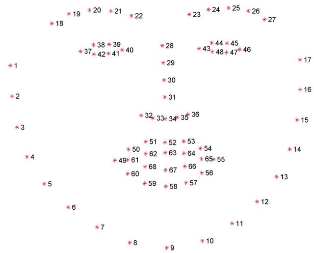

# FACE FILTER APPLICATION USING DLIB LIBRARY

Dlib is an open-source suite of applications and libraries written in C++ under a permissive Boost license. Dlib offers a wide range of functionality across a number of machine learning sectors, including classification and regression, numerical algorithms such as quadratic program solvers, an array of image processing tools, and diverse networking functionality, among many other facets.
It‘s a landmark’s facial detector with pre-trained models, the dlib is used to estimate the location of 68 coordinates (x, y) that map the facial points on a person’s face like image below. 

These facial landmarks can be used for different applications such as head pose estimation, face swapping, face alignment, and more.
Each facial feature is mapped with a set of points, for example, if we want to locate the nose in the face, we can use the points from28 to 36.  to use a pre-trained face landmark detector, we need to download the file shape_predictor_68_face_landmarks.dat
dlib.get_frontal_face_detector() is used in detecting the face in a frame or image.
To apply our facial landmarks detector to the face region we loop over the face bounding boxes, extract the coordinates of each bounding box, and draw a rectangle around each detected face.
dlib.shape_predictor() is a tool that takes in an image region containing some object and outputs a set of point locations that define the pose of the object. Here we use the shape_predictor_68_face_landmarks.dat model to create the predictor object. 

[captain](output/cap.mp4)
[batman](output/bat.mp4)
[spiderman](output/spidy.mp4)
[glasses](output/glasses.mp4)

**To migrate in the application**
- run: python Faceapp.py in your shell.

**To get all the required packages for this application**
- run: pip install -r requirements.txt in your shell.